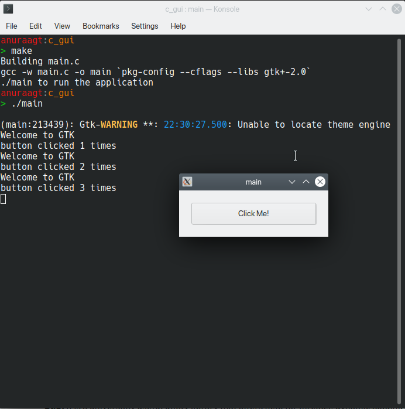

# GUI with C

This is a simple GUI window, created with GTK library, with C.

# Requirements

`libgtk2.0-dev`

```
sudo apt install libgtk2.0-dev
```

# Usage

```
make 
./main
make clean
```



# References

* [GeeksforGeeks Blog Page](https://www.geeksforgeeks.org/how-to-create-gui-in-c-programming-using-gtk-toolkit/)

* [Stackoverflow gtk path answer](https://stackoverflow.com/questions/24955686/gtk-gtk-h-not-found-on-ubuntu-c)

* [Stackoverflow gcc disable warnings](https://stackoverflow.com/questions/1452671/disable-all-gcc-warnings)
